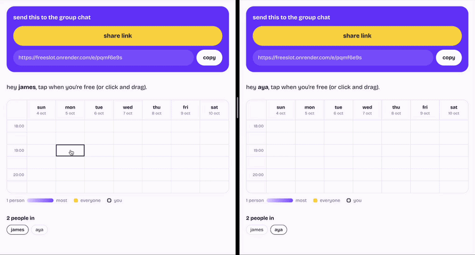

# freeslot

Find a time that works for your group. Make a plan, drop the link in the group chat, and everyone taps when they're free. The heatmap updates live for everyone, and the slots where the whole group can make it light up yellow.

I built it because When2meet is a pain on phones: tiny grid, no app, and sharing the link is an afterthought.

**Live demo:** <https://freeslot.onrender.com/e/demo>
(Free hosting, so the first load may take a moment to wake up.)



## Features

- No sign-up: share a plan by link, and friends just enter a name
- Live heatmap that updates for everyone as people pick times
- Slots where the whole group is free light up yellow, plus a "best time" summary
- Drag to select (or erase) on desktop, tap to toggle on mobile
- One-tap sharing to LINE, Instagram or iMessage via the native share sheet
- Installable as an app (Add to Home Screen), with link preview cards in group chats
- "Your plans" list on the home screen, no account needed
- Keyboard and screen-reader friendly grid

## Tech

Ruby on Rails 8, PostgreSQL, Hotwire (Turbo + Stimulus), Tailwind CSS v4. Deployed on Render.

## Design decisions

- **Live updates via Turbo page refreshes, not pushed HTML.** Each viewer's grid is personalised (their own slots are outlined), so a background broadcast can't render it for them. Instead the server broadcasts a "refresh" signal and each browser re-fetches its own view, which Turbo morphs in place without losing scroll position.
- **One row per available slot.** The heatmap is a single `GROUP BY` query, and toggling is an insert or delete. A drag is saved as one batch with `insert_all` / `delete_all`, backed by a unique database index so duplicates can't sneak in, even with simultaneous requests.
- **The server never trusts slot times from the browser.** Every slot is checked against the event's grid before it's saved, and you can't change anything until you've joined.
- **Identity by session cookie and name.** Re-entering the same name on another device picks up your existing slots. The trade-off, as with When2meet, is that anyone could edit a name they know; an optional per-person PIN would close that.
- **Touch uses tap, not drag.** On phones a drag can't be told apart from a scroll, so touch keeps scrolling natural and drag-to-select is a desktop feature.
- **Installable web app instead of a native one.** A PWA manifest plus the Web Share API gives the "open the app, send it to the group chat" feel without app-store friction. One trade-off: on iPhones the home-screen app keeps its own cookies, so "your plans" can differ between the app and Safari.
- **Single-database production setup.** Background jobs run in-process and Action Cable uses Postgres LISTEN/NOTIFY, so everything runs off one free database. At larger scale I'd move to Solid Queue with a separate worker.

## Running locally

```bash
bundle install
bin/rails db:setup
bin/dev
```

Then open http://localhost:3000, or http://localhost:3000/e/demo for a pre-filled example.

## Tests

```bash
bin/rails test
```

Model tests cover the scheduling rules (slugs, validation, grid maths, best-time ranges). Integration tests cover the main flows through real HTTP requests, including that you can't edit without joining and that invalid slot times are ignored.

## Ideas for later

- Per-viewer time zones for groups in different countries
- Optional PIN per participant
- "Who's free?" breakdown when tapping a slot
- Accounts or magic links so "your plans" syncs across devices
